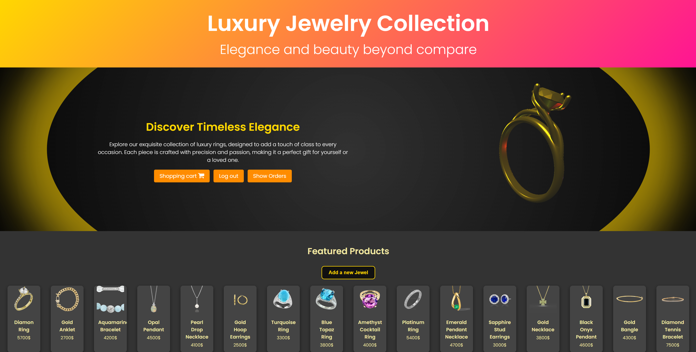

# 👋 Hi, I'm Barak Doron

🎓 Computer Science student | Incoming M.Sc. @ Reichman University  
💻 Full-stack & mobile developer | Passionate about cloud technologies

---

## ⚙️ Tech Highlights

C# • Python • JavaScript • React • React Native  
ASP.NET Core • AWS • SQL • DynamoDB • Lambda

---

## 🚀 Featured Projects

- [**E-Commerce Platform**](https://github.com/barakdo/aws-serverless-ecommerce-platform)
  Serverless app using AWS Lambda, DynamoDB, API Gateway, Cognito, S3, and SNS

- [**AI Tourist Guide App**](https://github.com/barakdo/react-native-tour-planner)
  Mobile app using Gemini AI for personalized tour content (React Native)

- [**Online Bookstore**](https://github.com/barakdo/online-bookstore-web-app)
  Full-stack web app with ASP.NET Core and SQL Server backend

---

## 🖼️ Project Screenshots

  
  
  

---

📫 [GitHub Portfolio](https://github.com/barakdo)
